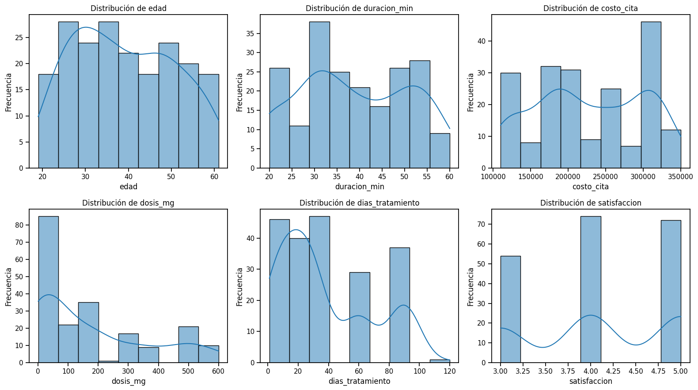
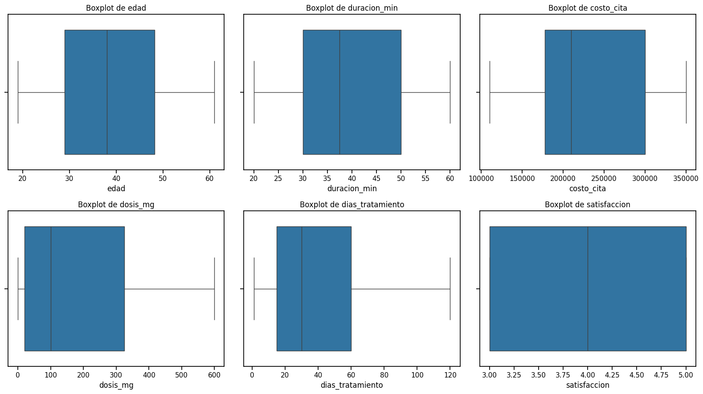
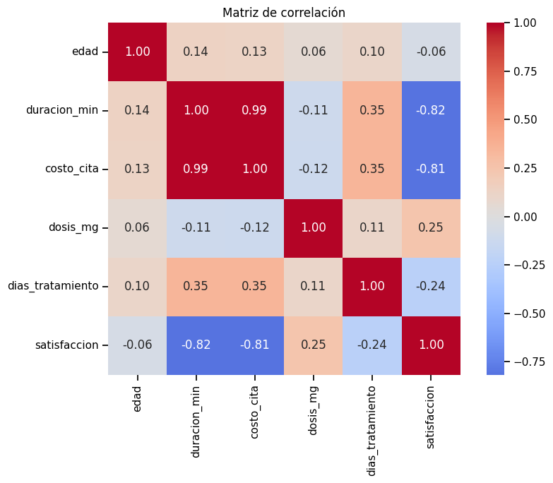
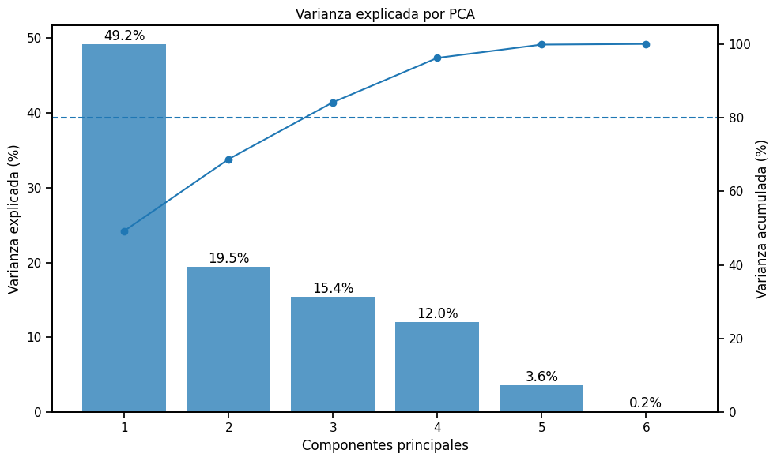
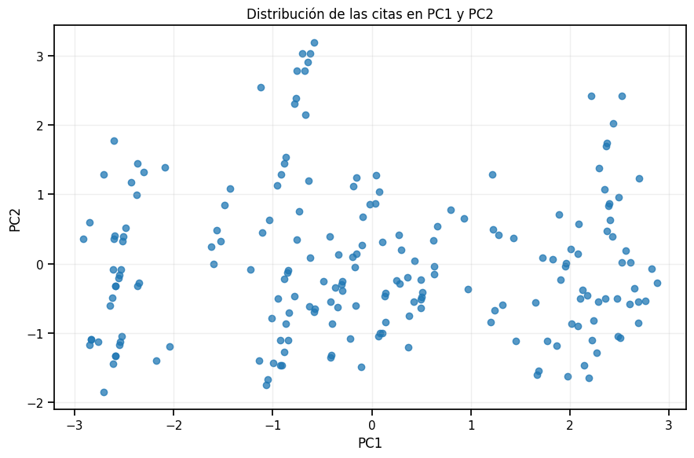
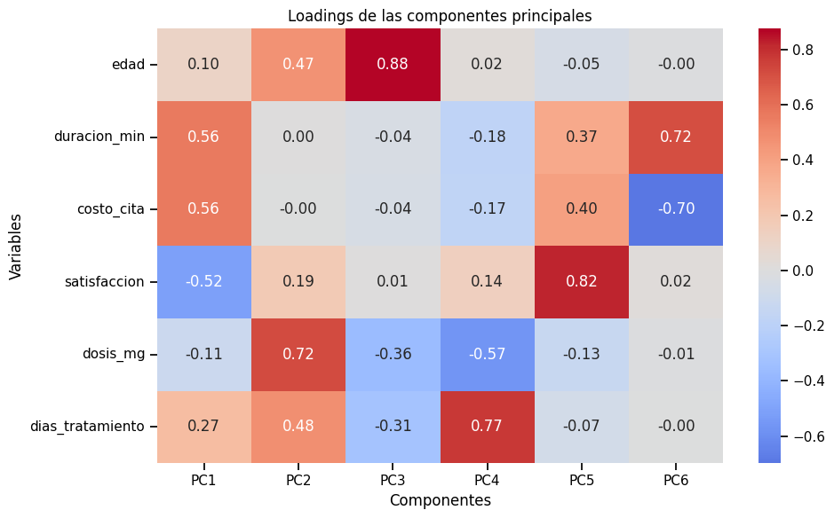
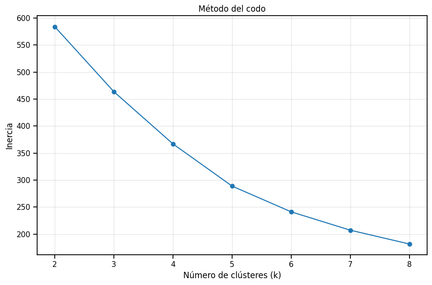
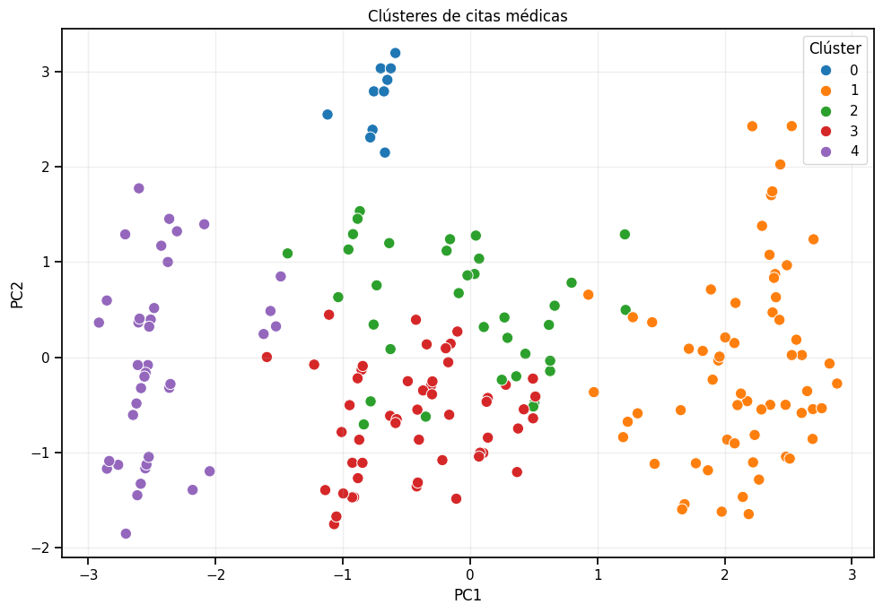
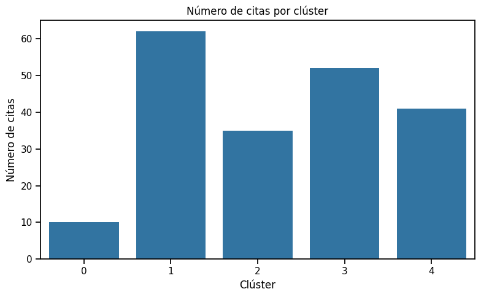
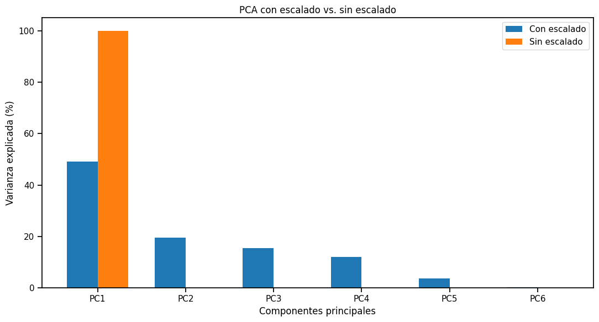

```{=latex}
\begin{titlepage}
\centering
\vspace*{3.5cm}
{\LARGE\bfseries Segmentación Inteligente de Servicios Clínicos\\[0.3em] mediante PCA y K-Means\par}
\vspace{1.2cm}
{\Large Taller Final — Machine Learning\par}
\vspace{1.5cm}
\rule{0.35\textwidth}{0.4pt}\par
\vspace{1.5cm}
{\large Juan Sebastián Laverde Chunza\par}
\vfill
{\large Universidad El Bosque\par}
\vspace{0.3cm}
{Doctorado en Ciencia de Datos e Inteligencia Artificial\par}
\vspace{0.3cm}
{Machine Learning\par}
\vspace{1cm}
{2026\par}
\vspace*{1.5cm}
\end{titlepage}

\renewcommand{\contentsname}{Contenido}
\tableofcontents
\clearpage
```

# Introducción

Este informe analiza una clínica ficticia que registra sus médicos, pacientes, citas y tratamientos en una base de datos relacional MySQL. La clínica quiere saber si sus citas forman **grupos naturales**, es decir, conjuntos de citas con duración, costo, satisfacción y tratamiento parecidos. Conocer esos grupos permite organizar mejor agendas, recursos y seguimiento.

Como no existe una etiqueta previa que indique a qué grupo pertenece cada cita, el problema es de **aprendizaje no supervisado**. Se aplican dos técnicas complementarias:

- **PCA (Análisis de Componentes Principales)** para resumir las seis variables numéricas en pocas componentes, conservando la mayor parte de la información.
- **K-Means** para agrupar las citas a partir de esas componentes.

Los resultados reportados provienen del notebook ejecutado del taller (`\texttt{Taller\_\allowbreak{}Clinica\_\allowbreak{}Machine\_\allowbreak{}Learning\_\allowbreak{}LAVERDE.ipynb}`{=latex}); todas las cifras de este informe se tomaron de sus salidas.

# Datos y consulta analítica

La información está distribuida en cuatro tablas relacionadas:

| Tabla | Contenido principal | Llave de relación |
|:--|:--|:--|
| `medicos` | especialidad y datos del médico | `id_medico` |
| `pacientes` | edad y datos del paciente | `id_paciente` |
| `citas` | fecha, duración, costo y satisfacción | `id_cita`, `id_paciente`, `id_medico` |
| `tratamientos` | medicamento, dosis y días de tratamiento | `id_cita` |

: Tablas de la base de datos de la clínica {#tbl-tablas}

La tabla `citas` actúa como eje: cada cita se une con su paciente (`id_paciente`), con su médico (`id_medico`) y con el tratamiento asociado (`id_cita`). El resultado es una fila por cita con todas las variables necesarias. La consulta se ejecutó con un usuario de **solo lectura** (el notebook verificó con `SHOW GRANTS` que solo tiene permiso `SELECT`).

```sql
SELECT
    c.id_cita          AS id_cita,
    m.especialidad     AS especialidad,
    p.edad             AS edad,
    c.duracion_min     AS duracion_min,
    c.costo            AS costo_cita,
    t.dosis_mg         AS dosis_mg,
    t.dias_tratamiento AS dias_tratamiento,
    c.satisfaccion     AS satisfaccion
FROM citas c
JOIN pacientes p    ON p.id_paciente = c.id_paciente
JOIN medicos m      ON m.id_medico   = c.id_medico
JOIN tratamientos t ON t.id_cita     = c.id_cita
ORDER BY c.id_cita;
```

El conjunto analítico resultante tiene **200 registros y 8 columnas**. Su uso es el siguiente:

- **Seis variables numéricas** entran a PCA y K-Means: `edad`, `duracion_min`, `costo_cita`, `satisfaccion`, `dosis_mg` y `dias_tratamiento`.
- **`especialidad`** no entra al modelo; se conserva solo para interpretar los clústeres después de formarlos.
- **`id_cita`** es un identificador de trazabilidad y no se usa como variable de Machine Learning.

# Análisis exploratorio

**Calidad de los datos.** Las 200 filas tienen las 8 columnas completas: **no hay valores faltantes** en ninguna variable y **no hay filas duplicadas**. Las variables numéricas son enteras (`edad`, `duracion_min`, `dias_tratamiento`, `satisfaccion`) o decimales (`costo_cita`, `dosis_mg`); `especialidad` es texto. La revisión de valores atípicos con el criterio del rango intercuartílico (1,5 × RIC) **no detectó ningún outlier**, por lo que las 200 citas se conservan sin modificaciones.

| Variable | Media | Desv. est. | Mín. | Q1 | Mediana | Q3 | Máx. |
|:--|--:|--:|--:|--:|--:|--:|--:|
| `edad` | 39,04 | 11,65 | 19 | 29 | 38 | 48,25 | 61 |
| `duracion_min` | 38,75 | 12,26 | 20 | 30 | 37,5 | 50 | 60 |
| `costo_cita` | 227.250 | 71.121 | 110.000 | 177.500 | 210.000 | 300.000 | 350.000 |
| `dosis_mg` | 180,05 | 188,40 | 0,5 | 20 | 100 | 325 | 600 |
| `dias_tratamiento` | 37,67 | 30,99 | 1 | 15 | 30 | 60 | 120 |
| `satisfaccion` | 4,09 | 0,79 | 3 | 3 | 4 | 5 | 5 |

: Estadísticas descriptivas de las seis variables numéricas (n = 200). Unidades: edad en años, duración en minutos, costo en pesos, dosis en mg, satisfacción en escala 1–5 {#tbl-descriptivas tbl-colwidths="[22,11,11,11,11,11,12,11]"}

La @tbl-descriptivas ya muestra el reto principal del análisis: `costo_cita` se mide en cientos de miles de pesos, mientras que `satisfaccion` solo toma valores entre 3 y 5. La satisfacción está concentrada en la parte alta de la escala: ninguna cita recibió calificación inferior a 3.

{#fig-histogramas width=92%}

Las distribuciones no son normales. `dosis_mg` y `dias_tratamiento` son asimétricas a la derecha: la mayoría de las citas tiene dosis bajas y tratamientos cortos, con un grupo menor de dosis altas (500–600 mg) y tratamientos de alrededor de 90 días. `costo_cita` y `duracion_min` muestran varios picos, lo que sugiere que existen tipos de consulta distintos. `satisfaccion` es discreta, con tres valores (3, 4 y 5).

{#fig-boxplots width=92%}

Los diagramas de caja confirman la ausencia de puntos fuera de los bigotes, coherente con el conteo de outliers igual a cero. También se aprecia la amplitud de `dosis_mg` y `dias_tratamiento` frente a variables más compactas como `edad`.

{#fig-correlacion width=68%}

La relación más fuerte es entre `duracion_min` y `costo_cita` (0,99): en esta clínica, las consultas más largas son prácticamente siempre las más costosas. Ambas se relacionan de forma negativa con `satisfaccion` (−0,82 y −0,81): las consultas largas y costosas tienden a recibir calificaciones más bajas. `dias_tratamiento` tiene una relación moderada con duración y costo (0,35), y `edad` casi no se correlaciona con las demás variables. Esta redundancia entre variables es precisamente lo que PCA aprovecha para resumir la información.

# Escalado

Antes de PCA y K-Means las seis variables se estandarizaron con `StandardScaler`. El motivo es práctico: ambos métodos trabajan con distancias y varianzas, y sin escalado una variable pesa según el tamaño de sus unidades, no según su importancia. Por ejemplo, una diferencia de 50.000 pesos en `costo_cita` es un cambio moderado, pero numéricamente sería miles de veces mayor que la diferencia entre la satisfacción mínima y máxima (2 puntos). Sin escalar, el costo decidiría casi todo el análisis.

Tras la transformación, el notebook verificó que las seis variables quedaron con **media 0,0000 y desviación estándar 1,0000**. Así todas las variables participan en igualdad de condiciones.

# Análisis de Componentes Principales (PCA)

Se ajustó PCA con todas las componentes posibles (seis) sobre los datos escalados para conocer cuánta varianza aporta cada una.

| Componente | Varianza explicada (%) | Varianza acumulada (%) |
|:--:|--:|--:|
| PC1 | 49,24 | 49,24 |
| PC2 | 19,49 | 68,73 |
| **PC3** | **15,44** | **84,17** |
| PC4 | 12,03 | 96,21 |
| PC5 | 3,62 | 99,82 |
| PC6 | 0,18 | 100,00 |

: Varianza explicada por cada componente principal (datos escalados) {#tbl-varianza}

{#fig-varianza width=74%}

**Tres componentes principales explican aproximadamente el 84,17 % de la varianza total.** Con dos componentes solo se alcanza el 68,73 %, por debajo del criterio del 80 %; con tres se supera ese umbral por primera vez. Por eso el modelo conserva **tres componentes**, que reducen el problema de seis a tres dimensiones perdiendo menos del 16 % de la información.

Conviene distinguir dos usos: PC1 y PC2 se usan para **visualizar** las citas en un plano, pero K-Means se entrena con **las tres componentes** que exige el criterio del 80 %. Que la gráfica sea bidimensional no significa que dos componentes sean suficientes.

{#fig-pc1pc2 width=70%}

La proyección ya sugiere estructura: aparece un grupo compacto a la izquierda, un grupo amplio a la derecha y un pequeño grupo aislado en la parte superior. Esta separación visual anticipa que existen segmentos de citas diferenciados.

# Interpretación de los loadings

Los *loadings* indican cuánto participa cada variable original en cada componente. Para interpretarlos se atiende sobre todo a su **magnitud** (valor absoluto).

| Variable | PC1 | PC2 | PC3 | PC4 | PC5 | PC6 |
|:--|--:|--:|--:|--:|--:|--:|
| `edad` | 0,104 | 0,468 | **0,876** | 0,023 | −0,050 | −0,004 |
| `duracion_min` | **0,564** | 0,005 | −0,040 | −0,178 | 0,370 | 0,715 |
| `costo_cita` | **0,563** | −0,002 | −0,041 | −0,173 | 0,404 | −0,699 |
| `satisfaccion` | **−0,520** | 0,185 | 0,006 | 0,142 | 0,821 | 0,020 |
| `dosis_mg` | −0,113 | **0,719** | −0,363 | −0,566 | −0,132 | −0,008 |
| `dias_tratamiento` | 0,266 | **0,479** | −0,312 | 0,773 | −0,071 | −0,002 |

: Loadings de las componentes principales {#tbl-loadings}

{#fig-loadings width=78%}

**PC1 — intensidad de la consulta.** Está dominada por `duracion_min` (0,564), `costo_cita` (0,563) y `satisfaccion` (0,520 en valor absoluto). Duración y costo se mueven en la misma dirección y la satisfacción en la contraria, lo mismo que mostraba la matriz de correlación. En términos prácticos, PC1 separa las consultas **cortas, económicas y bien calificadas** de las **largas, costosas y con menor satisfacción**.

**PC2 — perfil del tratamiento.** Está dominada por `dosis_mg` (0,719), seguida de `dias_tratamiento` (0,479) y `edad` (0,468). Duración y costo prácticamente no participan (|loading| ≤ 0,005). PC2 describe, por tanto, el **tratamiento asociado a la cita** (dosis y duración) junto con la edad del paciente, y es independiente de lo que ocurre dentro de la consulta.

PC3, la tercera componente retenida, está dominada por `edad` (0,876); por eso permite diferenciar grupos que en el plano PC1–PC2 aparecen superpuestos.

# Selección del número de clústeres

Se entrenó K-Means sobre las tres componentes retenidas para valores de `k` entre 2 y 8 (con `random_state = 42`) y se registró la inercia, que mide qué tan compactos son los grupos.

| k | 2 | 3 | 4 | **5** | 6 | 7 | 8 |
|:--|--:|--:|--:|--:|--:|--:|--:|
| Inercia | 584,17 | 463,73 | 366,99 | **288,86** | 241,17 | 207,16 | 181,59 |
| Reducción | — | 120,44 | 96,74 | 78,13 | 47,69 | 34,01 | 25,57 |

: Inercia de K-Means para cada valor de k y reducción respecto al valor anterior {#tbl-codo tbl-colwidths="[16,12,12,12,12,12,12,12]"}

{#fig-codo width=70%}

La inercia siempre baja al agregar clústeres, pero la ganancia se reduce. Hasta `k = 5` cada clúster adicional reduce la inercia en 78 unidades o más; a partir de `k = 6` la reducción cae a 48 y sigue disminuyendo. El punto de inflexión, identificado automáticamente con `KneeLocator`, es **k = 5**. El codo no es muy pronunciado, por lo que la elección se apoya también en que los cinco grupos resultan interpretables, como se muestra a continuación.

# Segmentación mediante K-Means

El modelo final se entrenó con `k = 5` sobre las tres componentes principales (`random_state = 42`, `n_init = 50`).

{#fig-clusters width=78%}

Los clústeres 4 (izquierda), 1 (derecha) y 0 (arriba) están claramente separados en el plano. Los clústeres 2 y 3 se superponen en esta vista porque su diferencia principal está en PC3, es decir, en la edad; esto confirma el valor de conservar la tercera componente.

| Clúster | Número de citas | Porcentaje |
|:--:|--:|--:|
| 0 | 10 | 5,0 % |
| 1 | 62 | 31,0 % |
| 2 | 35 | 17,5 % |
| 3 | 52 | 26,0 % |
| 4 | 41 | 20,5 % |
| **Total** | **200** | **100,0 %** |

: Tamaño de cada clúster {#tbl-tamanos}

{#fig-tamanos width=62%}

El clúster 1 es el más grande (casi una de cada tres citas) y el clúster 0 el más pequeño (10 citas); sus conclusiones deben leerse con cautela por su tamaño.

| Clúster | Edad | Duración (min) | Costo (\$) | Satisf. | Dosis (mg) | Días trat. |
|:--:|--:|--:|--:|--:|--:|--:|
| 0 | 41,10 | 35,00 | 205.000,00 | 5,00 | 600,00 | 90,00 |
| 1 | 40,31 | **53,63** | **312.741,94** | **3,15** | 146,05 | 50,48 |
| 2 | **53,06** | 37,57 | 221.428,57 | 4,26 | 155,71 | 37,14 |
| 3 | **29,58** | 35,48 | 210.384,62 | 4,21 | 107,52 | 36,73 |
| 4 | 36,66 | **22,32** | **129.756,10** | 5,00 | 241,82 | **7,15** |
| *Global* | *39,04* | *38,75* | *227.250,00* | *4,09* | *180,05* | *37,67* |

: Perfil promedio de cada clúster en las variables originales (edad en años) {#tbl-perfiles tbl-colwidths="[11,11,14,18,11,14,13]"}

**Clúster 0 — tratamientos de dosis máxima y mayor duración (10 citas).** Todas sus citas tienen la dosis más alta del conjunto (600 mg) y satisfacción perfecta (5,0); sus tratamientos duran en promedio 90 días, el valor más alto entre los clústeres. Duración y costo de la consulta son cercanos o inferiores al promedio. Lo que lo distingue no es la consulta sino el tratamiento.

**Clúster 1 — consultas largas y costosas con menor satisfacción (62 citas).** Tiene la mayor duración (53,6 min), el mayor costo (\$312.742) y la menor satisfacción (3,15). Sus tratamientos son de duración superior al promedio (50,5 días). Es el grupo más numeroso y el de mayor exigencia de tiempo y recursos.

**Clúster 2 — pacientes de mayor edad con perfil intermedio (35 citas).** Su rasgo principal es la edad promedio más alta (53,1 años). Duración, costo, satisfacción, dosis y días de tratamiento están muy cerca del promedio general.

**Clúster 3 — pacientes más jóvenes con dosis bajas (52 citas).** Reúne a los pacientes más jóvenes (29,6 años) y la dosis promedio más baja (107,5 mg). El resto de su perfil es similar al del clúster 2; la edad es lo que los separa.

**Clúster 4 — consultas breves y económicas con tratamientos cortos (41 citas).** Tiene la menor duración (22,3 min), el menor costo (\$129.756) y los tratamientos más cortos (7,2 días), con satisfacción perfecta (5,0). Su dosis promedio (241,8 mg) supera la media global.

# Especialidad predominante por clúster

La especialidad **no** se usó para formar los clústeres; se cruza con ellos después, para interpretarlos.

| Especialidad | Clúster 0 | Clúster 1 | Clúster 2 | Clúster 3 | Clúster 4 | Total |
|:--|--:|--:|--:|--:|--:|--:|
| Cardiología | 0 | 28 | 3 | 5 | 0 | 36 |
| Dermatología | 0 | 1 | 8 | **22** | 2 | 33 |
| Ginecología | **10** | 0 | 9 | 8 | 4 | 31 |
| Neurología | 0 | **33** | 1 | 0 | 0 | 34 |
| Ortopedia | 0 | 0 | **14** | 17 | 0 | 31 |
| Pediatría | 0 | 0 | 0 | 0 | **35** | 35 |
| **Total** | **10** | **62** | **35** | **52** | **41** | **200** |

: Distribución de especialidades por clúster (número de citas; en negrita, la especialidad predominante) {#tbl-especialidades tbl-colwidths="[22,13,13,13,13,13,13]"}

| Clúster | Especialidad predominante | Participación en el clúster |
|:--:|:--|--:|
| 0 | Ginecología | 10 de 10 (100,0 %) |
| 1 | Neurología | 33 de 62 (53,2 %) |
| 2 | Ortopedia | 14 de 35 (40,0 %) |
| 3 | Dermatología | 22 de 52 (42,3 %) |
| 4 | Pediatría | 35 de 41 (85,4 %) |

: Especialidad predominante en cada clúster {#tbl-predominante}

Los clústeres 0 y 4 están casi completamente asociados a una especialidad (Ginecología y Pediatría). El clúster 1 combina **Neurología y Cardiología** (33 y 28 citas): ambas comparten consultas largas y costosas, aunque Cardiología no predomina en ningún clúster. Los clústeres 2 y 3 son mixtos: Ortopedia y Dermatología predominan, pero con menos de la mitad de las citas.

Esta asociación es **descriptiva**: indica que ciertas especialidades comparten patrones de duración, costo y tratamiento, no que la especialidad haya causado el clúster.

# Importancia del escalado

Para responder qué ocurre sin escalar, el notebook repitió PCA y K-Means con las variables en sus unidades originales, manteniendo tres componentes y `k = 5`.

| Componente | Con escalado (%) | Sin escalado (%) |
|:--:|--:|--:|
| PC1 | 49,24 | **100,00** |
| PC2 | 19,49 | 0,00 |
| PC3 | 15,44 | 0,00 |
| PC4 | 12,03 | 0,00 |
| PC5 | 3,62 | 0,00 |
| PC6 | 0,18 | 0,00 |

: Varianza explicada con y sin escalado (valores redondeados a dos decimales) {#tbl-escalado}

{#fig-escalado width=72%}

Sin escalado, **PC1 concentra el 100,00 % de la varianza** (redondeado) y las demás componentes quedan prácticamente en cero. La explicación está en la @tbl-descriptivas: la desviación estándar de `costo_cita` (71.121) es cientos de veces mayor que la de cualquier otra variable (la siguiente es `dosis_mg`, con 188,40). Como la varianza es el cuadrado de la desviación, el costo aporta casi toda la varianza del conjunto y PC1 se convierte, en la práctica, en el costo de la cita. PCA deja de resumir las seis variables clínicas y solo refleja la unidad de medida más grande.

| Con escalado \\ Sin escalado | 0 | 1 | 2 | 3 | 4 |
|:--:|--:|--:|--:|--:|--:|
| 0 | 1 | 0 | 0 | 0 | 9 |
| 1 | 0 | **61** | 0 | 1 | 0 |
| 2 | 9 | 0 | 0 | 16 | 10 |
| 3 | 24 | 1 | 0 | 18 | 9 |
| 4 | 4 | 0 | **37** | 0 | 0 |

: Comparación de asignaciones de K-Means con y sin escalado (número de citas) {#tbl-asignaciones}

Los números de clúster son etiquetas arbitrarias, así que lo importante es si los grupos se conservan. Solo los dos grupos extremos en costo sobreviven: el clúster 1 (el más costoso) se mantiene casi intacto (61 de 62) y el clúster 4 (el más económico) conserva 37 de 41 citas. En cambio, los clústeres 0, 2 y 3, que se distinguen por dosis, días de tratamiento y edad, se reparten entre varios grupos: por ejemplo, las 52 citas del clúster 3 terminan divididas en 24, 18, 9 y 1. Sin escalado, la segmentación ordena las citas casi solo por su costo.

Por eso la solución **con escalado** es el análisis principal: es la única en la que las seis variables contribuyen de manera equilibrada y en la que aparecen perfiles definidos por el tratamiento y la edad, no solo por el precio.

# Recomendaciones para la clínica

Las recomendaciones son **operativas y administrativas**; ninguna implica decisiones de tratamiento, que el conjunto de datos no permite respaldar.

1. **Agenda diferenciada por duración (clústeres 1 y 4).** Las citas del clúster 1 duran en promedio 53,6 min y las del clúster 4, 22,3 min. Asignar franjas largas (cercanas a 60 min) al primer perfil y franjas cortas (20–25 min) al segundo reduce retrasos en cadena y tiempos muertos.
2. **Planeación de consultorios para el grupo más exigente (clúster 1).** Es el 31 % de las citas y el de mayor duración, sobre todo en Neurología y Cardiología. Reservar consultorios y personal de apoyo para estas especialidades en las franjas largas mejora el uso de la capacidad.
3. **Revisión de costos de las citas más caras (clúster 1).** Su costo promedio (\$312.742) supera en 38 % el promedio general, y el costo está casi completamente ligado a la duración (correlación 0,99). Conviene revisar si la tarifa refleja tiempo efectivo de atención y si hay oportunidades de optimizar la consulta.
4. **Seguimiento de la satisfacción (clúster 1).** Tiene la menor satisfacción (3,15, frente a 5,0 en los clústeres 0 y 4). Se recomienda una encuesta breve posterior a la cita para identificar causas, ya que el conjunto de datos no las registra (espera, comunicación, trámites u otras).
5. **Replicar las prácticas de los grupos mejor calificados (clústeres 0 y 4).** Ambos obtienen satisfacción de 5,0. Documentar cómo se organizan esas consultas (tiempos, información entregada al paciente) puede servir de referencia para el clúster 1.
6. **Seguimiento administrativo de tratamientos largos (clúster 0).** Sus tratamientos duran en promedio 90 días, con la dosis más alta (600 mg). Programar recordatorios y citas de control a lo largo del tratamiento facilita la continuidad. Dado que el grupo tiene solo 10 citas, debe validarse con más datos.
7. **Accesibilidad para pacientes de mayor edad (clúster 2).** Con 53,1 años de edad promedio y especialidades mixtas, este grupo puede beneficiarse de facilidades de acceso y horarios convenientes, organizados por perfil y no solo por especialidad.
8. **Actualizar la segmentación periódicamente.** Con 200 citas, los grupos son una primera aproximación; conviene repetir el análisis cuando crezca la base de datos para comprobar su estabilidad.

# Respuestas consolidadas a las preguntas del taller

**Pregunta 1. ¿Cuántas componentes principales explican al menos el 80 % de la varianza? ¿Por qué?**
Tres componentes, que explican el **84,17 %** de la varianza (PC1 49,24 %, PC2 19,49 % y PC3 15,44 %). Con dos componentes solo se llega al 68,73 %; la tercera es la primera que supera el umbral del 80 %. Esto es posible porque varias variables son redundantes, en especial duración y costo (correlación 0,99).

**Pregunta 2. ¿Qué variables dominan PC1 y PC2?**
PC1 está dominada por `duracion_min` (0,564), `costo_cita` (0,563) y `satisfaccion` (−0,520): resume la intensidad de la consulta. PC2 está dominada por `dosis_mg` (0,719), seguida de `dias_tratamiento` (0,479) y `edad` (0,468): resume el perfil del tratamiento y la edad del paciente.

**Pregunta 3. ¿Cuál es el número óptimo de clústeres según el método del codo?**
**k = 5.** Hasta cinco clústeres cada grupo adicional reduce la inercia en 78 unidades o más; desde seis, la reducción cae a 48 y sigue bajando. `KneeLocator` identificó el codo en k = 5.

```{=latex}
\needspace{14\baselineskip}
```

**Pregunta 4. Perfil promedio de cada clúster.**

| Clúster | Edad | Duración (min) | Costo (\$) | Satisf. | Dosis (mg) | Días trat. |
|:--:|--:|--:|--:|--:|--:|--:|
| 0 | 41,10 | 35,00 | 205.000,00 | 5,00 | 600,00 | 90,00 |
| 1 | 40,31 | 53,63 | 312.741,94 | 3,15 | 146,05 | 50,48 |
| 2 | 53,06 | 37,57 | 221.428,57 | 4,26 | 155,71 | 37,14 |
| 3 | 29,58 | 35,48 | 210.384,62 | 4,21 | 107,52 | 36,73 |
| 4 | 36,66 | 22,32 | 129.756,10 | 5,00 | 241,82 | 7,15 |

: Resumen del perfil promedio por clúster {#tbl-resumen-perfiles tbl-colwidths="[11,11,14,18,11,14,13]"}

En síntesis: el clúster 0 reúne tratamientos de dosis máxima y mayor duración; el 1, consultas largas, costosas y con menor satisfacción; el 2, pacientes de mayor edad con perfil intermedio; el 3, pacientes más jóvenes con dosis bajas; y el 4, consultas breves y económicas con tratamientos cortos.

**Pregunta 5. ¿Qué especialidad predomina en cada clúster?**
Clúster 0: Ginecología (100 %); clúster 1: Neurología (53,2 %, seguida de Cardiología con 45,2 %); clúster 2: Ortopedia (40,0 %); clúster 3: Dermatología (42,3 %); clúster 4: Pediatría (85,4 %).

**Pregunta 6. ¿Cómo cambian los resultados si no se escalan las variables?**
Cambian de forma sustancial. Sin escalado, PC1 explica el 100,00 % de la varianza porque `costo_cita` tiene una desviación estándar (71.121) cientos de veces mayor que las demás variables. K-Means solo conserva los grupos extremos en costo (clúster 1: 61 de 62 citas; clúster 4: 37 de 41) y dispersa los clústeres 0, 2 y 3, que dependen de dosis, días de tratamiento y edad (@tbl-escalado, @tbl-asignaciones y @fig-escalado).

**Pregunta 7. ¿Qué acciones concretas propondrías para la clínica?**
Agenda con franjas largas para el clúster 1 (53,6 min) y cortas para el clúster 4 (22,3 min); reserva de consultorios para Neurología y Cardiología; revisión de tarifas del clúster 1 (\$312.742); encuesta de satisfacción para el clúster 1 (3,15); documentar las prácticas de los clústeres 0 y 4 (satisfacción 5,0); recordatorios y controles para los tratamientos largos del clúster 0 (90 días en promedio); facilidades de acceso para el clúster 2 (53,1 años); y repetir la segmentación al crecer la base de datos.

**Pregunta 8. ¿Qué riesgos éticos implicaría usar estos clústeres para decisiones clínicas?**
El uso de estos clústeres para decisiones clínicas implica riesgos relacionados con sesgos en los datos, privacidad de la información y posibles interpretaciones incorrectas de los grupos. Los clústeres representan patrones estadísticos y no diagnósticos médicos, por lo que deben utilizarse como apoyo al análisis y no como sustituto del criterio profesional.

# Conclusiones

El taller integró una base de datos relacional de cuatro tablas mediante una consulta `JOIN`, que produjo un conjunto limpio de 200 citas sin faltantes, duplicados ni valores atípicos. Tras estandarizar las variables, PCA redujo seis variables a **tres componentes que conservan el 84,17 % de la varianza**; la primera resume la intensidad de la consulta (duración, costo y satisfacción) y la segunda, el tratamiento y la edad.

K-Means, con **k = 5** según el método del codo, encontró cinco perfiles de citas diferenciados e interpretables, asociados de manera descriptiva a especialidades concretas. La comparación sin escalado mostró que este paso es indispensable: sin él, el costo domina todo el análisis.

Los resultados son útiles para el análisis exploratorio y la gestión operativa (agendas, consultorios, costos y seguimiento de la satisfacción), pero no tienen validez clínica: los clústeres describen patrones de atención, no condiciones de los pacientes, y deben validarse con más datos antes de apoyar decisiones.
